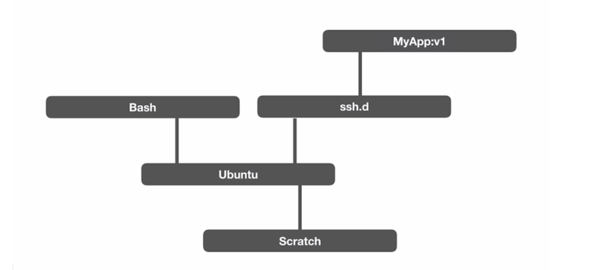
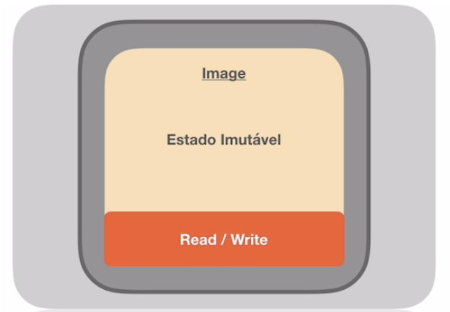

# Docker
## O que são Containers
Um container é um padrão de unidade de software que empacota código e todas as dependências de uma aplicação fazendo que a mesma seja executada rapidamente de forma confiável de um ambiente computacional para o outro.

Mas o que isso significa? Isso é uma resposta genérica…
Como funcionam os Containers
Um sistema operacional tem diversos processos que ficam rodando. Vamos imaginar que o Processo 1, conforme o tempo foi passando e as tecnologias foram evoluindo nós conseguimos trabalhar com componente chamado Namespaces. Namespaces é uma forma de se isolar os processos. 

### Namespaces
Sistema Operacional

```
Processo pai Container 1
	Processo filho container 1
	Processo filho container 1
	Processo filho container 1
```

Quando estamos falando de Container nós estamos falando de processos. E esses processos são isolados com processos filhos. Ou seja, todos os processos que o container vai executar serão executados pelos processos filhos.

Quando matamos o processo principal, o nosso container é automaticamente destruído.

```
Sistema Operacional
- Pid
- User
- Network
- File system
```

### Cgroups
Além disso, nós temos os Cgroups, na qual o Google dá manutenção. Sem os Cgroups seria impossível trabalhar com os containers. Os Cgroups controlam (isolam) os recursos computacionais do container. Por exemplo: memory = 500MB e cpu_shares = 512.

### File System
Os file system dos containers e principalmente do docker trabalham com OFS (Overlay File System). OFS significa podemos trabalhar com camadas (layers), cada layer trabalha de forma individualizada, ou seja, a layer pega a diferença do que foi alterado e na próxima versão só usaremos a difereça, não precisando de cópia inteira do Sistema Operacional.

### Imagens
Imagens são criadas apartir de camadas, ou seja, uma imagem é um conjunto de depêndencias encadeadas. Por exemplo para uma imagem de uma aplicação minha (MyApp:v1) tem as seguintes depêndencias: ssh.d, Ubuntu, Scratch.



Da mesma forma nos podemos substituir alguma depêndencia que apresente algum problema, além de que uma depência pode ser reaproveitada em uma outra imagem.

Imagens geralmente tem nome e versão.

As imagens ficam armazenadas dentro de um <b>Image Registry</b>, que funciona como se fosse um repositório. Você consegue pegar uma imagem desse repositório atraves de um <b>pull</b>. Apartir de uma imagem você consegue enviar para o <b>Image Registry</b> por meio de um <b>push</b>.

### Dockerfile
Arquivo declarativo utilizado para construir imagens.

FROM: ImageName -> imagem base utilizada
RUN: comandos podemos rodar nessa imagem (ex: apt-get install)
EXPOSE: 8000 -> exposição de portas

<b>*OBS:</b> um processo de uma imagem é imutável, por isso conseguimos subir um container de forma tão rápida.

<b>*OBS II:</b> O docker disponibiliza uma camada de Read/Write dentro do container, possibilitando a criação de arquivos dentro do container.



Se por acaso nós matamos esse container, tudo o que foi escrito na camada Read/Write será perdido.

Através de um build em um docker file criará uma nova imagem.

Outra forma de gerar uma imagem é por meio do <b>commit</b>, criando uma nova imagem baseada no container que está rodando.

## Como o Docker funciona
O Docker criou uma solução na qual ele consegue integrar os <b>Namespaces, Cgroups e o File System</b>, e baseado nesses três pontos ele conseguiu criar um conceito chamado <b>Docker Host</b>. Docker Host é onde o Docker fica rodando, dentro do Docker Host nos temos a <b>daemon</b> (um processo rodando em background), que é uma API que fornece a comunicação entre o <b>Docker Client</b> e o Docker Host.

Dentro do Docker Host nós temos uma camada de <b>Cache</b>, que evita ficar fazendo download de uma mesma imagem.

<b>Volumes</b>, é a forma de salvar dados fora do container, preservando os dados quando o container morre.

<b>Network</b> é responsavel pela comunicação (gerenciamento de redes) entre os containers.

## Comandos básicos
- docker ps: mostra quais containers estão rodando na máquina
- docker ps -a: mostra todos os containers 
- docker run <image-name>: sobe um container - utilizando determinada imagem
- docker run  -it <image-name>: sobe um container utilizando determinada imagem. -i (atacha no terminal do containerl) -t (significa tty, ou seja, nós podemos digitar no terminal).
- docker start <container-name>: roda um container
- --rm: na hora que o container morrer, o docker remove o container
- -p: publica uma porta da máquina que esta executando o Docker CLI. Ex -p 8080:80
- -d: deteash (não bloqueia o terminal)
- docker stop <container-id>: para de rodar o container desejado
- docker rm <container-id> | <container-name>: exclui o container desejado
- docker rmi <image_name>: remove a imagem solicitada
- -f: flag de fornce, usada para forcar algum comando
- --name: flag usada para nomear um container
- docker exec: executa um comando no container
- docker pull <image_name>: baixa a imagem desejada
- docker login: comando usado para logar na conta do docker hub
- docker push: <image_name>: push para docker hub
- docker rm $(docker ps -a -q) -f: apaga todos os containers

## Bind mounts
Basicamente é possível montar uma pasta que está no nosso computador para dentro do container. Com isso, se caso o container morrer nós ainda teremos o nossos dados salvos no nosso computador.

Exemplo de uso de volume, com a flag -v:

```
docker run -d --name nginx -p 8080:80 -v ~/Dev/full-cycle/docker/html:/usr/share/nginx/html nginx
```

Uma observação que deve-se notar é que se nós passarmos um caminho inesistente, por exeplo uma pasta a mais no caminho do bind, ele vai acabar criando essa pasta na nossa maquina.

Uma forma mais atual de fazer o bind de volume é utilizando a flag <b>--mount</b>, como no exemplo asseguir. Note que fica explicito aonde é a fonte e onde está sendo salvo os arquivos. Outro ponto é que o problema de usar um caminho errado como no exemplo do -v não ocorre com a flag --mount.

```
docker run -d --name nginx -p 8080:80 --mount type=bind,source="$(pwd)",target=/usr/share/nginx/html nginx
```

## Volumes
Nós conseguimos criar um volume na nossa máquina e mapear esse volume para usar no container. Outro ponto interessante dos Volumes é que podemos utilizar o mesmo volume para mais de um container.

- docker volume: comando dos volumes
- docker volume ls: lista volumes
- docker volume create <volume_name>: cria um volume
- docker volume inspect <volume_name>: mostra informações do volume
- docker volume prune: apaga todos os volumes utilizados

Apontando um volume para um container:

```
docker run -d --name nginx -p 8080:80 --mount type=volume,source=meuvolume,target=/app nginx
```

Apontando um volume usando -v

```
docker run --name nginx3 -d -v meuvolume:/app nginx 
```

## Imagens
Comando de exemplo básico de criação de uma imagem:

```
docker build -t gabrieljayme/nginx-com-vim:latest .
```

A flag -t é a nossa Tag seguida do nosso usuario do DockerHub. No final temos um 'ponto final' que é o caminho onde está localizado o nosso Dockerfile.

### WORKDIR
É um comando que cria um diretorio onde nós vamos trabalhar dentro do nosso container. É como se quando o docker começar a criar nossa imagem ele criasse uma pasta la dentro e deixasse a gente la dentro.
Por exemplo criar uma pasta app:

```
WORKDIR /app
```

### RUN
Utilizado para executar comandos dentro do nossa imagem

```
RUN apt-get update && \
    apt-get install vim -y
```

### COPY
Utilizado para copiar alguma pasta ou arquivo para dentro da nossa iamgem

```
COPY html /usr/share/nginx/html
```

## CMD
É um comando váriavel, ou seja, você consegue passar algum valor (parametro) na hora de construir o container dessa imagem. Outro ponto é que o CMD sempre é executado após o ENTRYPOINT. O CMD pode ser usado para passar parametros para o ENTRYPOINT. Exemplo:

```
CMD [ "World" ]
```

## ENTRYPOINT
É um comando sempre fixo, por exemplo:

```
ENTRYPOINT [ "echo", "Hello" ]
```

### EXEC “$@”
Todo arquivo .sh que tiver esse comando ao final dele faz com que ele vai aceitar os parametros que forem passados depois que esse arquivo ser executado.

## Networks

### Entendendo tipos de Networks
O docker possui um mecanismos de network internamente. Ela pode servir para que um container se comunique com outro container. Por exemplo um Laravel se conectar com MYSql só sera possível se esses dois containers estiverem na mesma rede. E é nisso que os tipos de networks aparecem.

#### BRIDGE
É o mais comum entre os outros tipos. Quando se cria uma network sem informar o tipo, por default ela sera a bridge. Normalmente é utilizada para fazer a comunicação facilmente entre os containers.

#### HOST
Ele mescla a network do docker com a network do host do docker. Ela funciona para que um container possa se comunicar com a maquina host, sem precisar fazer a exposição de porta.

#### OVERLAY
Usado para fazer a comunicação de vários dockers em diferentes máquinas e precisamos de uma comunicação entre eles. Exemplo de uso é o Docker Swarm.

#### MACLAN
É possíovel setar uma MAC adress num container e ele vai parecer com uma network plugada na nossa rede.

#### NONE
É quando nao vai ter nenhuma rede no container, rodando de forma isolada.

### Comandos da network:
- docker network: lista os comandos que pode ser feitos na network
- docker network ls: lista todas as redes
- docker network prune: remove todas as networks sem utilidade
- docker network create --driver <network_type> <network_name>: cria uma network
- docker network connect <network_name> <container_name>: vai setar uma nova network para o container especificado.

### Trabalhando com bridge
Quando criamos uma nova network, por exemplo uma bridge, e criarmos um novo container utilizando essa nova rede, nos conseguimos forçar a comunicação pelo nome dos containers. No entanto se não apontarmos a bridge na hora da criação do container e comunicação será possível apenas via número de IP.

### Trabalhando com host
Não funciona no MacOS, pois o docker foi feito pra rodar no Linux. No caso do MacOS ele emula uma VM pra conversar com o docker. O docker host é uma maquina virtual. Quando eu criar uma network host, o docker vai juntar a rede do docker com a rede da maquina virtual do MacOS, mas não com a rede do prórpio mac, por isso que essa network não funciona. Já no WSL2 essa rede funciona.

### Container acessando nossa maquina
As vezes você vai estar utilizando o seu container docker, mas la do seu container precisa acessar alguma porta ou recurso do docker host. Pare resolver esse problema será necessário de dentro do container utilizar o path:

```
http://host.docker.internal:<port_number>
```

## Otimizando imagens
Quando estamos trabalhando em modo de desenvolvedor nos vamos utilizar uma imagem com muitos recursos instalados. No entanto, se nos desejamos colocar essa imagem em produção, nós com certeza vamos desejar possuir uma imagem mais enxuta, pois quanto menor melhor (mais rapido para subir a image, mais rapido para baixar a imagem), além de que com uma imagem menor, a chance de ter alguma vulnerabilidade também é menor.

Geralmente para criamor imagens bem pequenas nós utilizamos imagens do Alpine Linux, que é uma distro bem enxuta.

### Otimização utilizando Multistage Building
Multistage Building nada mais é do que você faz o processo de build da sua imagem em duas ou mais etapas. Ou seja, nós temos o estágio inicial (onde a gente gerta a imagem) e o próximo estágio que é onde nós otimizamos a nossa imagem.

